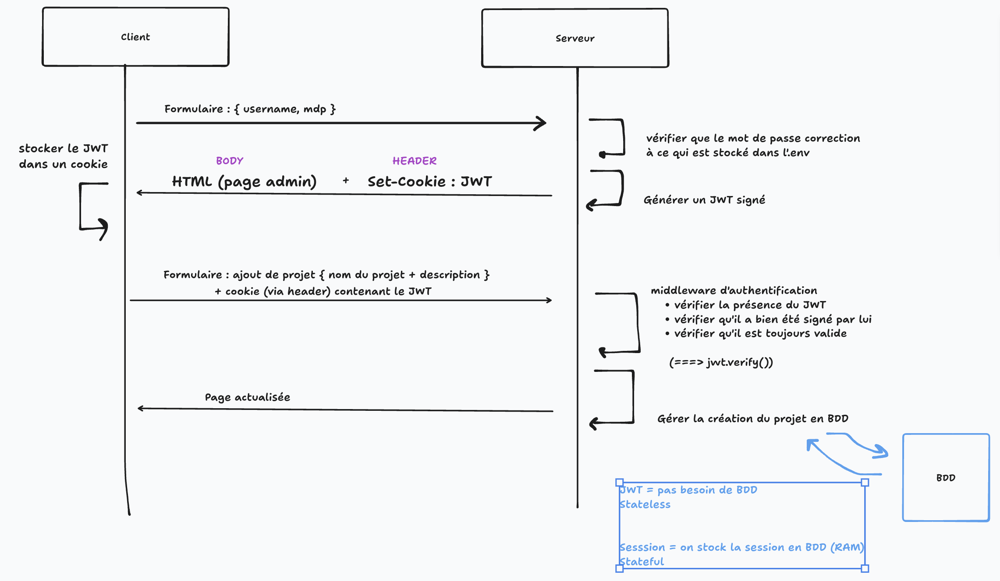
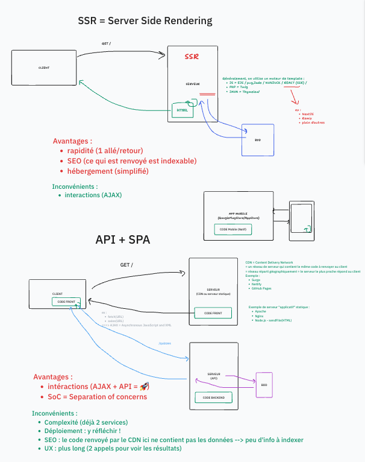

# BONUS - Design Review

## Déroulé

Profiter de la correciton pour échanger avec les apprenants sur les questions qu'ils se sont posés et tenter d'apporter des éléments de réponse. Il s'agit surtout d'une discussion pour apporter votre expertise sur certains point, notamment architectural.

## BONUS - Exemple de questions avec les apprenants

Questions complémentaires des étudiants lors de la première session : 

- **Q. on n'a pas de page de connexion pour l'admin ?**
- **Q. j'avais un doute sur la ligne "Technologies : raw HTML/CSS/JS" dans les notes**
  - ne vous laissez pas inflencer, en particulier si le client ne s'y connait pas trop.
- **Q. du NoSql , si il n'y pas d'utilisateur?**
  - NoSQL = problématiques particulières
    - `Redis` = problématique de cache / session utilisateur
    - `Mongo` = données destructurées / inconsistentes (logs)
    - `neo4JS` = données à organiser sous forme de graphe
    - `ElasticSearch` = moteur de recherche
    - `Matomo` = pour l'analytics (service SaaS, pas une BDD directement à brancher sur une BDD SQL)
  - SQL = si besoin d'un CRUD sur des données structurée

- **Q. quelle architecture de solution ? plutôt SSR ou plutôt API / SPA ?** 
  - site vitrine -> SEO important -> page web doivent renvoyées du HTML contenant de la data ! HTML doit être généré côté serveur avec les données des projet
  - peu d'intéraction (CRUD sur une entité -> rechargement de page pour l'administrateur : OK)
- Utiliser un CMS ? CMS JS ? 
  - plus rapide
  - prototyper rapidement
  - profiter de nombreux template visuel
  - profiter d'un backoffice déjà fourni (connexion)
  - pluging additionnels (SEO)
  - CMS :
    - `Wordpress` (PHP)
    - `Strapi` (JS) = Headless CMS (génial) --> fournir API + un backoffice (mais pas le front)
    - `Directus` (JS) = headless CMS
    - `Magento` / `Shopify` (ecommerce)

Autres questions en vrac : 
- Charte graphique ? Quel contenu dans les cartes ? Quelles info dans le formulaire de contact ?
- Qui va créer les projets ? un seul compte ou plusieurs compte ? 
- Public cible ? Persona ?
- Quels réseaux sociaux ?
- Quels types d’informations doivent figurer sur chaque fiche projet ? (description, date, client, durée, technos, lien externe…)
- Avez-vous des besoins d'interconnectivité (ex : saleforce pour ajouter dans le pipe les personnes qui vous contact)
- Charte graphique de l'entreprise ? Typographie ? Graphiste ?
- Contenus marketing ? Qui rédige ? Landing pages SEO ?
- Clients internationaux ? Localisation des contenus ?
- **Comment gérer les droits de l'administrateur ?**

## BONUS - Espace administrateur

Problématique : 
- Comment gérer l'authentification de l'utilisateur administrateur ?

Contexte : 
- Admettons qu'on ait une application Node, avec rendu côté serveur. 
- Un seul administrateur (Jeff)

Reflexion : 
- un seul administrateur ? --> besoin de le stocker en BDD ? 
  - non pas forcement : un simple MDP administrateur stocké dans un `.env` peut faire l'affaire
  - lorsque l'utilisateur s'authentifie avec le bon MDP, on lui envoie un token JWT de connexion lui permettant d'authentifier ses requêtes suivantes.

Diagramme de séquence :

## BONUS - Choix architectural

