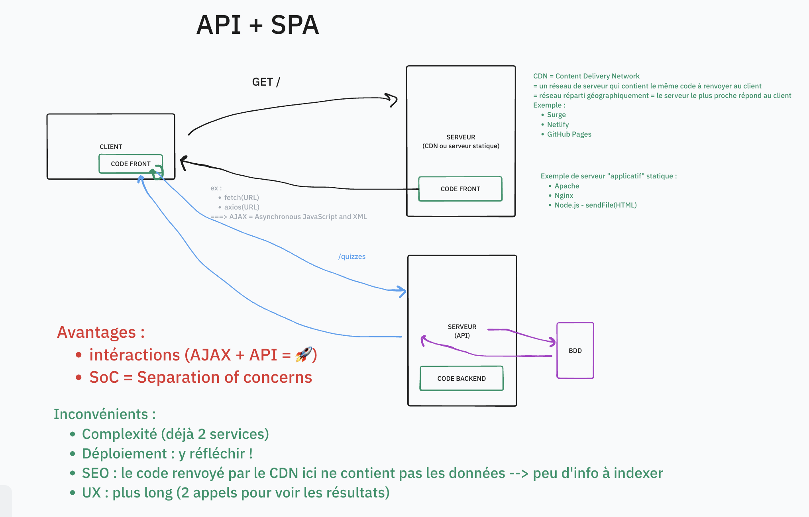
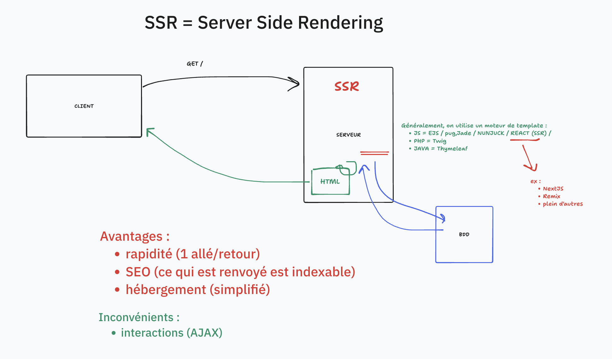

# SC01E01 - Gestion de projet et modélisation UML

## Menu du jour 

- Présentations (30min)
  - Brise glace
  - Bloc C
  - Titre Pro
  - Menu du jour

- Gestion de projet (2H)
  - Demande client (vidéo)
  - Clarification du besoin
  - Récits utilisateurs (`user stories`)

- Modélisation UML (2H)
  - Outillage PlantUML
  - Différents diagrammes
  - Diagramme : cas d'utilisation

- Challenge
  - Analyse d'un besoin
  - User stories
  - Diagramme cas d'utilisation

## Brise glace

Exemple de brise glace (quelques sondages en cours)

D'où viens-tu ?
- Ile-de-France
- Nord/Nord-Est
- Nord-Ouest
- Sud-Est
- Sud-Ouest
- DOM-TOM
- Autre

D'où viens-tu ?
- Bloc A-B
- Ancienne promo JS (Oclock)
- Ancienne promo AUTRE (Oclock)
- P'tit nouveau/nouvelle !

J'ai un titre DWWM ?
- oui
- non
- peut-être

Expérience en stage ou entreprise ?
- oui, < 6mois
- oui, > 6mois
- pas encore !

Environnement hôte
- MacOS (Intel)
- MacOS (M1->M4)
- Windows 10
- Windows 11
- Linux

Je code :
- plutôt sur mon Windows avec WSL
- plutôt sur ma VM

Language de programmation (le plus utilisé)
- JavaScript
- PHP
- Python
- Autre

BDD (la plus utilisé)
- PostgreSQL
- MySQL
- MariaDB
- MongoDB

Expérience avec Docker
- Très peu pratiqué
- Couramment pratiqué

Tu t'mets combien en Git/Github ?
- 1/5
- 2/5
- 3/5
- 4/5
- 5/5

## Architecture

## Vobulaire

Rédaction pour les semaines à venir : 
- 🇫🇷 Français : 
  - `un quiz`
  - `des quiz`
- 🇺🇸 Anglais : 
  - `one quiz`
  - `many quizzes`

## UML 

**Unified Modeling Language** = Langage graphique pour modéliser un système (ou parties d'un système)

Divers graphiques à dispositions (séquences, classes, entité-relations) : objectif clarifier le besoin et se faire comprendre e communiquer avec les collègues.

Il existe plusieurs languages pour générer les graphiques (PlanUML, Mermaid) -> ce qui importe, c'est le graphique, pas le code.

