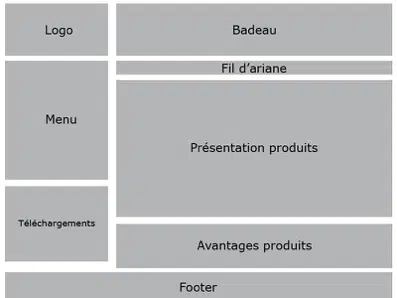
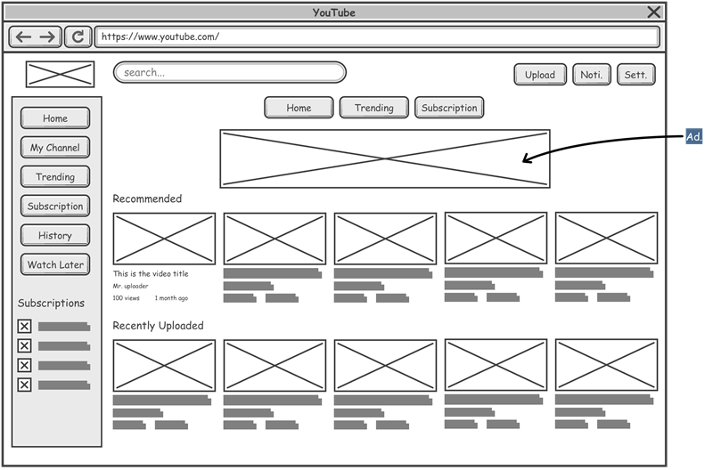
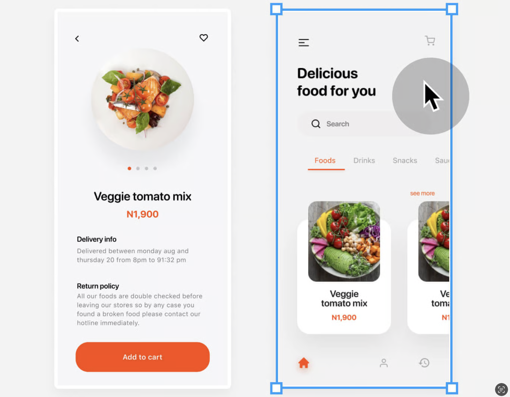
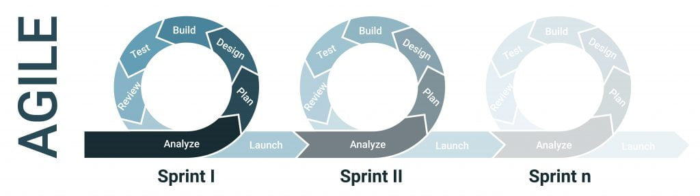
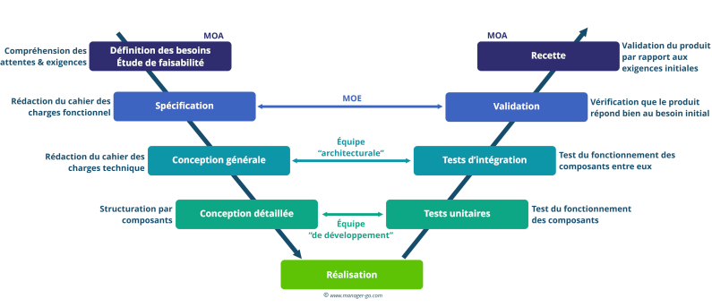
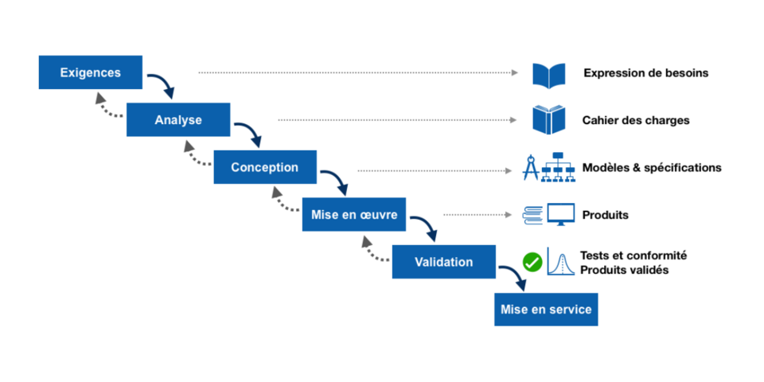

# SC01E02 - Web Design

## Menu du jour 

- O'vitrine (correction commentée)
  - "Des questions sans réponse ?"
  - Récits utilisateurs
  - Diagramme cas d'utilisation (UML)
    - o'vitrine
  - Discussions architecturales
    - SSR vs API ?

- Web Design
  - Zoning
  - Wireframes
  - Mockups
  - Prototype

- Gestion de projet
  - Agile ou Waterfall
  - Outils agiles (Kanban)
  - Diagramme de séquence

- Challenge
  - Gitflow
  - Web design
  - Diagramme de séquence

## Pull Request

- Créer une branche : 
  - `git checkout -b BRANCHE`

- Push la branche : 
  - `git push`
  - `git push --set-upstream origin BRANCHE` (la première fois)

- Créer une Pull Request (GitHub)
  - attention au sens
  - `main` <-- `BRANCHE`

- Merge Pull Request (Github)
  - bouton `Merge`

- Mettre à jour `main` en local
  - penser à fermer vos onglets (ça va switcher)
  - `git checkout main`
  - `git pull`

### Recap 

| Zoning                                | Wireframes                               | Mockup                               |
| ------------------------------------- | ---------------------------------------- | ------------------------------------ |
|  |  |  |

## Conseil Titre Pro

L'objectif est de montrer que l'on connait la démarche de design ui/ux : 
- zoning
- wireframes
- mockup
- prototype 

Donc, le plus simple, c'est de présenter l'ensemble de ces documents pour UNE fonctionnalités, dans son ensemble : 
- penser à faire des wireframes versions mobiles (responsive)
- penser aux différents rôles

## Exercice (en cours): wireframes

A l'aide de l'outil de votre choix :
- **Whimsical**
- TLDraw / Excalidraw
- Wireframes.cc
- Figma
- ...

**Réaliser le wireframes de la home page** (version Desktop et/ou mobile).

- Attention : la "home page" (de l'app) n'est pas la "page vitrine" (pour le SEO). La home page présente donc quelques quizzes sur lesquels un utilisateur connecté va pouvoir cliquer pour aller les jouer.

- Une fois terminé, poster votre wireframe dans un thread sur un canal slack :
  - Objectif : le formateur commente vos wireframes pour vous éviter de refaire des erreurs similaires dans le future

## Mockup Figma

- Représente l’interface finale ou quasi-finale avec tous les éléments visuels.
- Intègre les couleurs, typographies, images, icônes, et branding.
- Sert à valider l’aspect visuel et à créer un rendu fidèle au produit final.
- Utilisé pour la communication avec les développeurs, grâce à l’inspecteur de code (CSS, tailles, assets…).
- Ciblé pour les équipes UI, les parties prenantes, et les développeurs en phase d’implémentation.

Demo Figma possible à ce stade (voir replay si nécessaire) : 
- frames & sections
- composants réutilisables
- variables réutilisables

## Prototype

- Simuler l’interaction utilisateur avec l’interface (sans coder ou en codant le moins possible).
- Tester les parcours utilisateurs (ex. : s’inscrire, ajouter un produit au panier, etc.).
- Valider l’ergonomie et la logique de navigation.
- Identifier les points de friction ou d’incompréhension avant le développement.
- Communiquer l’expérience utilisateur aux parties prenantes (clients, développeurs, testeurs…).
- Effectuer des tests utilisateurs sur des scénarios concrets.
- Réduire les coûts de développement en détectant les erreurs tôt dans le processus.
- Aligner l’équipe produit/développement autour d’une vision claire et interactive du futur produit

=> Possible de les réaliser avec Figma, en connectant les maquettes etre elles.

=> Possible de simplement coder un solution "fil-de-fer" (sans prendre en compte le design final, la gestion d'erreur, etc...)

## Sites web pour l'inspiration en web Design 

- https://www.awwwards.com/
- https://www.landingfolio.com/
- https://dribbble.com/
- https://www.behance.net/ (Adobe)

## IA tools

Tester la création d'une interface pour Oquiz
- https://stitch.withgoogle.com/ (pour générer des mockups)
- https://www.relume.io/ ($ pour générer des wireframes et des mockups)
- https://www.visily.ai/ (pour passer d'une image à un wireframe)
- https://cloud.google.com/use-cases/free-ai-tools?hl=fr

## Librairies CSS (ou de composants) qui proposent des design systems

- Bootstrap
- Bulma
- Pico (parfait pour prototyper car pas de classe à écrire)
- Shadcn (particulièrement customizable)
- Tailwind
- Ant Design
- Materialize
- Material UI (MUI)
- Mantine
- et la liste est longue ! 

## Ressource complémentaire pour l'inspiration

- Landing pages : https://www.landingfolio.com/
- Landing pages : https://www.webdesign-inspiration.com/
- Composants / UI Snippets : https://uiverse.io/
- Composants / UI Snippets : https://freefrontend.com/
- Codepen / UI Snippets : https://codepen.io
- Awards : https://thefwa.com/about/about-fwa/
- Couleurs : https://coolors.co/
- Couleurs : https://colorhunt.co/
- Couleurs : https://color.adobe.com/fr/trends

## Agile vs Cycle en V

| Agile                               | Cycle V                               | Cascade                               |
| ----------------------------------- | ------------------------------------- | ------------------------------------- |
|  |  |  |
