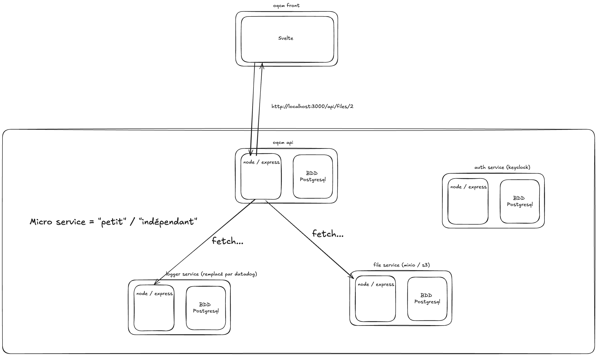

# SC04E01 - Logger & microservice

## Objectifs de la journée

- Log
  - Comprendre pourquoi le simple console.log n'est pas suffisant
  - Ce qui est intéressant de log (erreur / http pour les stats / debug pour trouver des erreurs en prod)
- Voir un plan d'ensemble avec des micro services

## Objectif du logger

1. **Diagnostic et Résolution de Problèmes (Débogage)**

- **Identifier la cause racine :** Les logs d'erreurs, avec leur message et leur pile d'appels (stack trace), permettent aux développeurs de localiser précisément la ligne de code défaillante.
- **Comprendre le contexte :** Des logs bien conçus ne se contentent pas de signaler une erreur, ils fournissent un contexte précieux : l'état de l'application, les données en cours de traitement, l'identité de l'utilisateur, etc.

2. **Surveillance et Alerte en Temps Réel (Monitoring)**

- **Détection proactive des problèmes :** En analysant le flux de logs, on peut détecter des anomalies (par exemple, une augmentation soudaine du taux d'erreurs) et déclencher des alertes avant que les utilisateurs ne soient massivement impactés.
- **Surveillance des performances :** Les logs peuvent enregistrer des métriques de performance comme les temps de réponse des requêtes ou la durée des appels à la base de données. Cela aide à identifier les goulots d'étranglement et à optimiser les performances.
- **Visualisation de l'état du système :** Les logs agrégés peuvent alimenter des tableaux de bord qui offrent une vue d'ensemble de la santé de l'application.

3. **Sécurité et Conformité**

- **Détection d'activités suspectes :** Les journaux d'accès et d'authentification permettent de repérer les tentatives de connexion échouées, les accès non autorisés ou tout autre comportement suspect.
- **Piste d'audit (Audit Trail) :** Les logs créent une piste d'audit immuable de toutes les actions effectuées dans le système. C'est crucial pour savoir qui a fait quoi et quand, ce qui est souvent une exigence pour la conformité à des normes comme le RGPD, HIPAA, ou PCI DSS.
- **Analyse post-incident :** En cas d'incident de sécurité, les logs sont essentiels pour l'analyse forensique afin de comprendre comment l'attaque s'est produite, quelle a été son étendue et comment y remédier.

4. **Analyse de l'Activité et Business Intelligence**
   Au-delà des aspects techniques, les logs peuvent fournir des informations précieuses sur l'utilisation de l'application.

- **Comprendre le comportement des utilisateurs :** En analysant les logs d'événements, on peut comprendre quelles sont les fonctionnalités les plus utilisées, les parcours utilisateurs les plus courants ou les points de friction dans l'application.
- **Prise de décision :** Ces informations peuvent orienter les décisions produit et métier, par exemple en décidant de prioriser le développement d'une fonctionnalité populaire ou d'améliorer une partie de l'application peu utilisée.

## En pratique

Ça pourrait se résumer à un `console.log`. Mais dans la pratique on va privilégier des outils de logging qui vont nous permettre de :

- Enrichir avec plus d'information (timestamp / nom de l'application)
- Logger dans un certain format (json), ce qui permettra de plus facilement trier / filtrer les logs lors de leur analyse
- Spécifier plusieurs moyen de transmettre les logs (transport : console / fichier / http)
- Gérer plus facilement les différents niveaux de log (info / http / warning / error / ...) et quel log afficher / envoyer

## Winston

Winston va nous permettre de faire nos logs de manière structurée et personnalisée.

- `npm install winston`
- On va se créer un fichier `lib/log.ts` pour centraliser notre logger

```typescript
import process from 'node:process';
import { createLogger, format, transports } from 'winston';
import { config } from '../../config.js';

export const logger = createLogger({
  level: config.logLevel || 'info',
  format: format.combine(
    format.timestamp(),
    format.errors({ stack: true }),
    format.json(),
    format.printf(({ timestamp, level, message, ...meta }) => {
      return JSON.stringify({
        timestamp,
        level,
        message,
        service: 'oquiz',
        pid: process.pid,
        ...meta,
      });
    })
  ),
  transports: [
    // Logs d'erreur dans un fichier séparé
    new transports.File({
      filename: 'error.log',
      level: 'error',
      maxsize: 5242880, // 5MB
      maxFiles: 10,
      tailable: true,
    }),
    // Tous les logs dans un fichier combiné
    new transports.File({
      filename: 'combined.log',
      maxsize: 5242880, // 5MB
      maxFiles: 10,
      tailable: true,
    }),
  ],
  // Gérer les exceptions non capturées
  exceptionHandlers: [new transports.File({ filename: 'exceptions.log' })],
  // Gérer les rejets de promesses
  rejectionHandlers: [new transports.File({ filename: 'rejections.log' })],
});

// Ajouter la console en développement
if (process.env.NODE_ENV === 'development') {
  logger.add(
    new transports.Console({
      format: format.combine(
        format.colorize(),
        format.simple(),
        format.printf(({ timestamp, level, message, stack, ...meta }) => {
          const metaString = Object.keys(meta).length ? JSON.stringify(meta, null, 2) : '';
          const stackString = stack ? `\n${stack}` : '';
          return `${timestamp} [${level}]: ${message}${stackString}${metaString ? `\n${metaString}` : ''}`;
        })
      ),
    })
  );
}
```

Utilisation

```typescript
import logger from './lib/log.js';

// Exemple de log d'information
logger.info('This is an info log', { additionalData: 'value' });
// Exemple de log d'erreur
try {
  throw new Error('This is an error');
} catch (error) {
  logger.error('An error occurred', { error: error.message });
}
```

## Log des requêtes HTTP

Le but est de logguer les requêtes HTTP pour pouvoir les analyser plus tard.

- Le temps de réponse (duration)
- Le code de statut HTTP (status)
- L'URL / méthode de la requête (path / method)
- L'IP de l'utilisateur (ip)
- L'agent utilisateur (user-agent)
- L'id de la requête (x-request-id) pour pouvoir dans le cas d'une architecture microservice, identifier la requête qui serait traitée par un autre service

Puis ensuite, on envoie les logs vers notre logger.

```typescript
// api/src/@types/express.d.ts
declare global {
  namespace Express {
    interface Request {
      // ...
      // Pour les logs des requêtes HTTP
      requestId?: string;
      log: typeof logger;
    }
  }
}
```

```typescript
// api/src/middlewares/log-request.middleware.ts
import type { Request, Response, NextFunction } from 'express';
import { randomUUID } from 'crypto';
import { logger } from '../lib/logger.ts';

export function logRequest(req: Request, res: Response, next: NextFunction) {
  const id = req.get('x-request-id') || randomUUID();
  req.requestId = id;
  // En cas de traitement dans un autre service, on va pouvoir identifier la requête
  res.setHeader('x-request-id', id);
  // On va pouvoir utiliser le logger avec le requestId pour pouvoir identifier la requête
  req.log = logger.child({ requestId: id });
  // Pourquoi on utilise process.hrtime.bigint() ? Pour avoir une précision plus grande
  // https://nodejs.org/api/process.html#processhrtimebigint
  const start = process.hrtime.bigint();

  res.on('finish', () => {
    // On va pouvoir calculer le temps de réponse de la requête
    const durMs = Number(process.hrtime.bigint() - start) / 1e6;
    // Et logguer la requête
    req.log.http('http_request', {
      method: req.method,
      path: req.originalUrl,
      status: res.statusCode,
      durationMs: Math.round(durMs),
      ip: req.ip,
      userAgent: req.get('user-agent'),
    });
  });
  next();
}
```

```typescript
// api/src/app.ts
// ...
import { logRequest } from './middlewares/log-request.middleware.ts';
// ...

app.use(logRequest);

app.use(router);

// ...
```

## Microservice

Un microservice est une architecture logicielle (moyen de s'organiser) qui consiste à décomposer une application en petits services indépendants, chacun responsable d'**une** fonctionnalité spécifique. Chaque microservice peut être développé, déployé et mis à l'échelle **indépendamment** des autres.



## Début du microservice de log

- Créer un nouveau projet avec `npm init`
- Créer un fichier `index.ts`
- Créer un fichier `package.json` (`npm init -y`)
- Créer un fichier `tsconfig.json` (copier le contenu de `api/tsconfig.json`)
- Installez `tsx` (`npm install tsx`) + script dans le `package.json` pour lancer le serveur
- Faire le [README](../../logs-service/README.md) avec une commande pour démarrer une BDD mongodb avec docker
- Installer le package `mongodb` et faire le client pour se connecter à la BDD (voir [lib/db.ts](../../logs-service/src/lib/db.ts))

## Challenge

[CHALL-SC04E01](../challenges/CHALL-SC04E01/CHALL-SC04E01.md)
