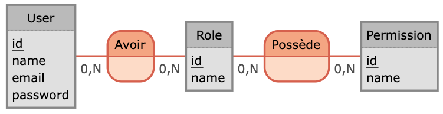

# 🗂️ **Gestion des Rôles, Droits et Permissions**

## Vocabulaire

| Concept         | Définition                                           | Exemple                           |
| --------------- | ---------------------------------------------------- | --------------------------------- |
| **Utilisateur** | Personne ou système qui interagit avec l'application | Jean Dupont                       |
| **Rôle**        | Groupe de permissions attribué à l'utilisateur       | Admin, Rédacteur                  |
| **Permission**  | Droit d’exécuter une action sur une ressource        | Créer un article                  |
| **Action**      | Opération spécifique                                 | Créer, Lire, Modifier, Supprimer  |
| **Ressource**   | Entité ciblée par l’action                           | Article, Commentaire, Utilisateur |

## Modèles de gestion des permissions

### RBAC (Role-Based Access Control)

- **Principe** :
  - on associe les permissions aux rôles, puis les rôles aux utilisateurs.
- **Exemple** :
  - Rôle Admin → toutes les permissions
  - Rôle Visiteur → lecture uniquement
- **Avantages** :
  - Simple à comprendre et implémenter
  - Facile à maintenir avec peu de rôles
- **Inconvénients** :
  - Peu flexible dans les cas complexes (contextes variables)
- **Cas d’usage** :
  - Entreprises structurées, applications avec rôles bien définis.

### ABAC (Attribute-Based Access Control)

- **Principe** :
  - accès basé sur des attributs de l’utilisateur, de la ressource, et du contexte.
- **Exemple** :
  - "Autoriser l'accès si l’utilisateur est dans le même département que la ressource"
  - "Autoriser la modification si l'utilisateur est le créateur de la ressource"
- **Avantages** :
  - Très flexible
  - Adapté aux règles complexes ou dynamiques
- **Inconvénients** :
  - Implémentation plus complexe
  - Plus difficile à auditer (donc tester automatiquement est incontournable)
- **Cas d’usage** :
  - Systèmes complexes, administration publique.

### ACL (Access Control List)

- **Principe** :
  - chaque ressource possède une liste de permissions associée à des utilisateurs ou rôles.
- **Exemple** :
  - Fichier X → {Jean : Lecture ; Marie : Lecture/Écriture}
- **Avantages** :
  - Contrôle très fin par ressource
- **Inconvénients** :
  - UX souvent complexe
- **Cas d’usage** :
  - Systèmes de fichiers, outils de collaboration comme Google Docs.

Attention à ne pas confondre avec l'acronyme `Access Control Layer` = couche logicielle qui gère les droits d'accès (terme générique donc).

### Approches hybrides

Il est tout à fait possible de combiner RBAC et ABAC. Par exemple :

- RBAC : _tu es auteur_
- ABAC : _mais tu ne peux modifier que les articles que tu as créés_

C'est une implémentation courante dans les apps modernes.

## Comment affecter les permissions ?

### Permissions prédéfinies ou persistées

| Méthode                            | Avantages                     | Inconvénients                         | Quand l’utiliser                              |
| ---------------------------------- | ----------------------------- | ------------------------------------- | --------------------------------------------- |
| **Permissions codées en dur**      | Simple, rapide, performant    | Peu flexible, nécessite redeploiement | Peu de rôles fixes, appli simple              |
| **Permissions en base de données** | Contrôle dynamique des droits | Complexe, surcharge potentielle       | Espace administrateurs pour donner des droits |

### Stockage des rôles et permissions

| Besoin                                        | Solution technique                                                                                    |
| --------------------------------------------- | ----------------------------------------------------------------------------------------------------- |
| Peu de rôles, droits des rôles fixes          | Attribut `role` directement sur l'utilisateur + permissions (par rôle) codé en dur dans l'application |
| Rôles multiples par utilisateurs ou évolutifs | Table `roles` (`user_roles`) + affectation des rôles aux utilisateurs via une interface               |
| Permissions granulaires & dynamiques          | **URP** : `users`, `roles`, `permissions` (`user_roles`, `role_permissions`)                          |

## Associer les permissions à quoi ?

### Associer aux ENDPOINTS

- **Explication** : un endpoint = une permission (niveau `router`)
- **Avantages** : rapide, direct, lisible sur les routes
- **Inconvénients** : couplé à l'API, peu réutilisable
- **Quand** : petite API REST ou back-office simple.

| Permission        | Endpoint            |
| ----------------- | ------------------- |
| `user:get-all`    | `GET /users`        |
| `user:patch-one`  | `PATCH /users/:id`  |
| `user:delete-one` | `DELETE /users/:id` |

### Associer aux ACTIONS METIER

- **Explication** : une action/fonction métier = une permission (niveau `service`).
- **Avantages** : découplé de l’API, réutilisable (REST, GraphQL, CLI), évolutif.
- **Inconvénients** : nécessite une couche service bien structurée
- **Quand** : logique métier riche, besoin de contrôle.

| Permission    | Action                   |
| ------------- | ------------------------ |
| `user:create` | Créer un utilisateur     |
| `user:read`   | Lire un utilisateur      |
| `user:update` | Modifier un utilisateur  |
| `user:delete` | Supprimer un utilisateur |

## Résumé des cas d'usage

| Besoin                                        | Approche possible                                                                               |
| --------------------------------------------- | ----------------------------------------------------------------------------------------------- |
| CRUD simple et stable                         | Attribut `role` sur l’utilisateur + permissions sur endpoints                                   |
| Plusieurs rôles par utilisateurs              | Table de jointure `user_roles` pour attribuer plusieurs rôles à un même utilisateur             |
| Gestion fine des permissions par rôle         | Modèle URP : `users`, `roles`, `permissions`, `role_permissions`                                |
| Gestion fine des permissions par utilisateurs | Modèle URP + table `user_permissions` pour ajouter des permissions spécifiques à un utilisateur |
